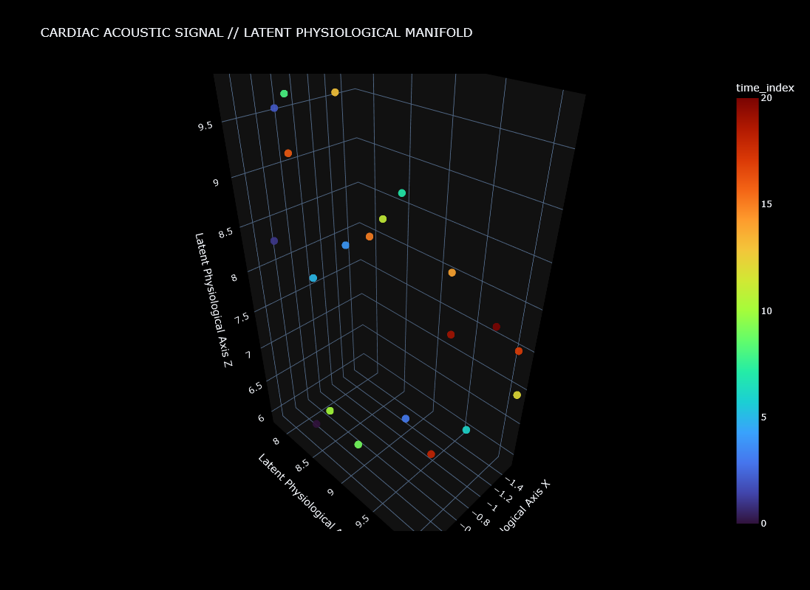
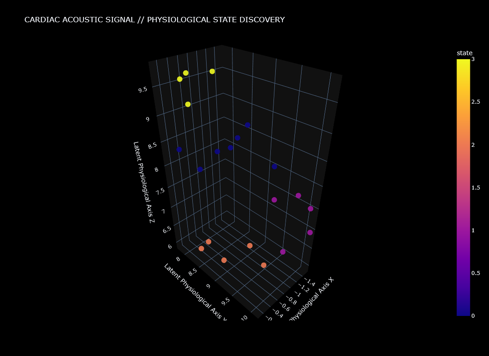
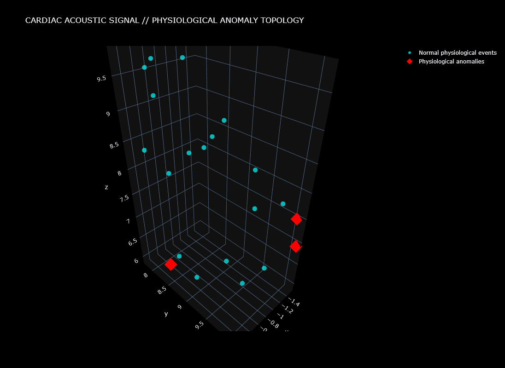
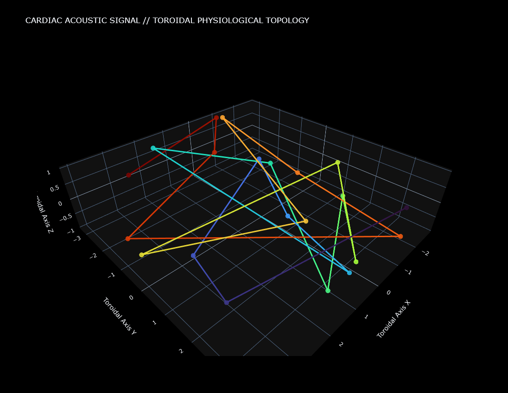
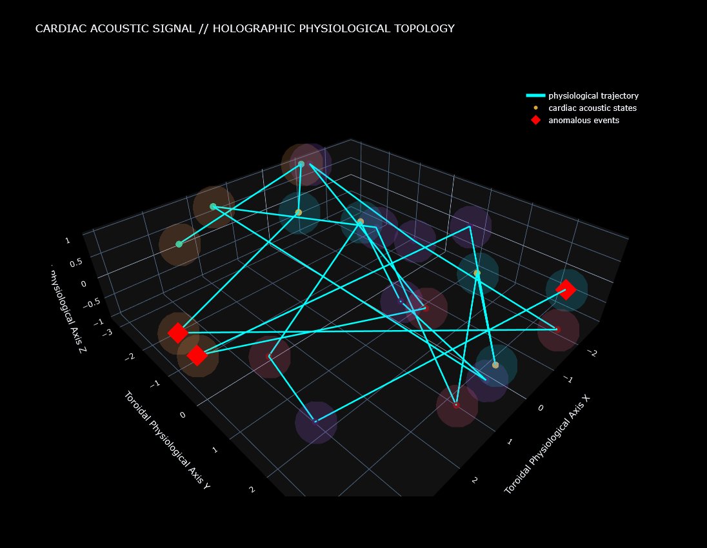

# Latent Physiological Topology  
## Dynamic State-Space Modeling of Cardiac Acoustic Signals

[](https://doi.org/10.5281/zenodo.MY_DOI_HERE)


---

## Overview

This project extends the **Bioacoustic Topology** framework into the domain of biomedical acoustic signal analysis.

Rather than treating cardiac auscultation as isolated waveform classification, the framework investigates whether cardiac acoustic activity may be modeled as:

- latent physiological manifolds,
- recurrent trajectory systems,
- dynamical state-space traversal,
- cyclic physiological topology,
- and distributed acoustic occupation structure.

The project explores whether phonocardiogram recordings exhibit measurable latent organization when analyzed through:

- nonlinear manifold learning,
- physiological trajectory reconstruction,
- probabilistic state transitions,
- anomaly topology,
- toroidal cyclic embedding,
- orbital phase analysis,
- and holographic physiological density rendering.

Importantly, this framework is exploratory and computational.  
It does **not** provide clinical diagnosis or medical decision support.

---

# Conceptual Direction

The framework investigates whether physiological acoustic systems may exhibit:

- recurrent latent organization,
- partially stabilized acoustic states,
- directional manifold traversal,
- cyclic physiological recurrence,
- and distributed topological structure.

Within this perspective:

- cardiac acoustic events become state-space coordinates,
- physiological transitions become latent trajectories,
- and recurrent cardiac dynamics become structured traversal through latent physiological topology.

The broader objective is not diagnostic classification alone, but exploration of whether physiological acoustic systems may exhibit measurable organizational principles when modeled through latent geometric state-space.

---

# Core Framework Components

## Physiological Acoustic Segmentation
Continuous cardiac waveforms are segmented into discrete computational acoustic events suitable for manifold analysis.

## Feature Space Construction
Each cardiac acoustic event is transformed into a multidimensional physiological descriptor vector integrating:

- MFCCs,
- spectral descriptors,
- energetic structure,
- and temporal acoustic properties.

## Latent Physiological Manifold
The feature space is projected into a three-dimensional latent manifold using UMAP.

This enables investigation of:

- acoustic similarity organization,
- recurrent physiological regions,
- and trajectory evolution through latent topology.

## Physiological State Discovery
Unsupervised clustering identifies recurrent physiological acoustic states distributed throughout latent manifold structure.

## Transition Dynamics
Sequential event reconstruction enables probabilistic analysis of:

- state persistence,
- recurrent transition corridors,
- and physiological trajectory evolution.

## Physiological Anomaly Detection
Trajectory-based anomaly scoring identifies dynamically unusual cardiac acoustic events occupying atypical latent-space regions.

## Toroidal Physiological Topology
Latent trajectories are additionally projected onto cyclic toroidal geometry in order to investigate recurrence-preserving physiological organization.

## Orbital Synchronization Analysis
Orbital phase statistics are estimated to explore cyclic physiological recurrence behavior within toroidal topology.

## Holographic Physiological Density Fields
Volumetric density rendering approximates recurrent physiological manifold occupation regions and distributed acoustic structure.

---

# Example Visualizations

## Latent Physiological Manifold


## Physiological State Discovery


## Physiological Anomaly Topology


## Toroidal Physiological Topology


## Holographic Physiological Topology


---

# Dataset

This project uses a subset of the:

### CirCor DigiScope Phonocardiogram Dataset

PhysioNet:
https://physionet.org/content/circor-heart-sound/

The dataset contains pediatric cardiac auscultation recordings collected for computational heart sound analysis research.

---

# Technologies

- Python
- Google Colab
- Librosa
- UMAP
- Scikit-learn
- Plotly
- NumPy
- Pandas
- Matplotlib

---

# Repository Structure

```text
latent-physiological-topology/
│
├── notebooks/
│   └── latent_physiological_topology.ipynb
│
├── images/
│   ├── latent_physiological_manifold.png
│   ├── physiological_state_discovery.png
│   ├── physiological_anomaly_topology.png
│   ├── toroidal_physiological_topology.png
│   └── holographic_physiological_topology.png
│
├── README.md
├── LICENSE
└── requirements.txt
```

---

# Limitations

The framework remains exploratory and hypothesis-generating.

The project does **not** claim:

- clinical diagnosis,
- pathological inference,
- physiological mechanism discovery,
- or biologically validated cardiac topology.

Similarly:

- toroidal geometry,
- orbital synchronization,
- and attractor interpretations

should be understood as computational abstractions rather than direct physiological mechanisms.

---

# Future Directions

Potential future extensions include:

- larger-scale physiological datasets,
- comparative cardiac manifold analysis,
- multimodal physiological integration,
- graph neural network trajectory modeling,
- persistent homology and topological data analysis,
- real-time physiological topology rendering,
- and streaming biomedical manifold visualization systems.

---

# Research Positioning

This project contributes toward an emerging computational perspective combining:

- biomedical acoustic analysis,
- manifold learning,
- nonlinear dynamical systems,
- geometric machine learning,
- computational topology,
- and physiological trajectory modeling.

More broadly, the framework explores whether physiological systems may be investigated not only as signals, but as evolving dynamical structures embedded within latent geometric state-space.

---

# Citation

If referencing this work:

```bibtex
@software{palis2026latentphysiologicaltopology,
  author       = {Palis, Sabrina},
  title        = {Latent Physiological Topology: Dynamic State-Space Modeling of Cardiac Acoustic Signals},
  year         = {2026},
  publisher    = {Zenodo},
  doi          = {10.5281/zenodo.MY_DOI_HERE}
}
```

---

# Author

**Sabrina Palis**  
Independent Researcher  
AI • Computational Topology • Dynamical Systems • Bioacoustic Modeling

---

# Disclaimer

This project is intended solely for exploratory computational research and educational purposes.

It is not a medical device and should not be used for clinical diagnosis, treatment, or healthcare decision-making.
